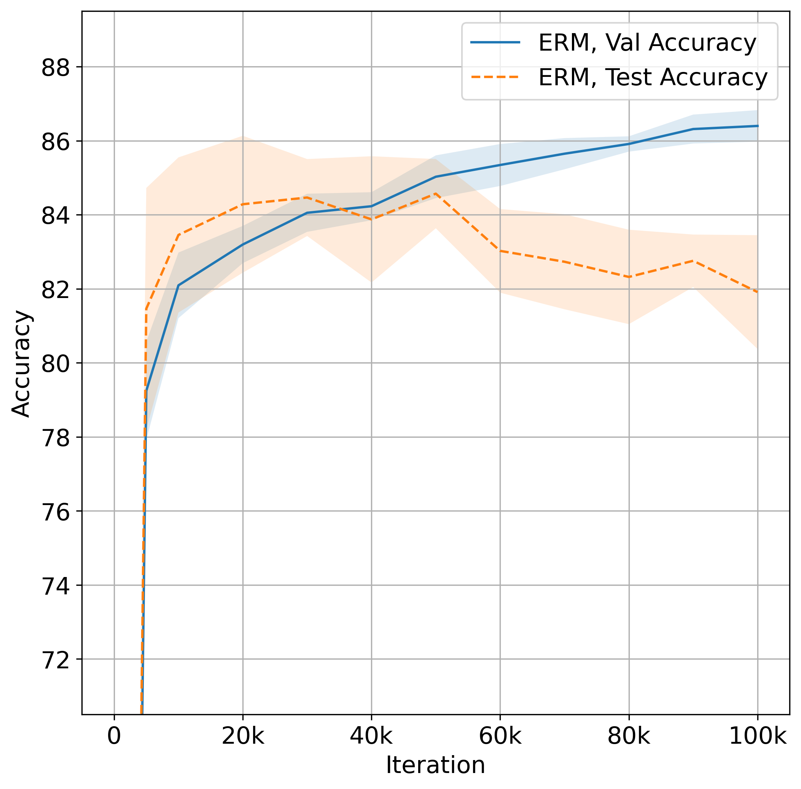
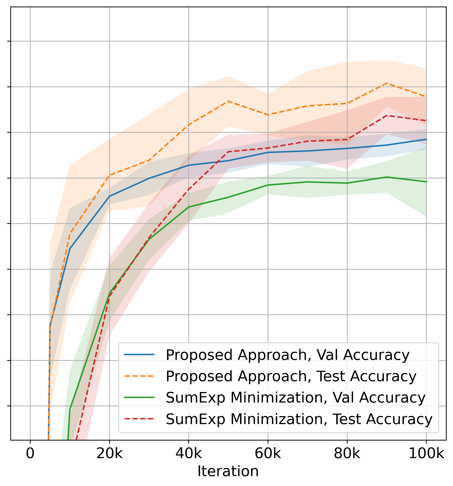
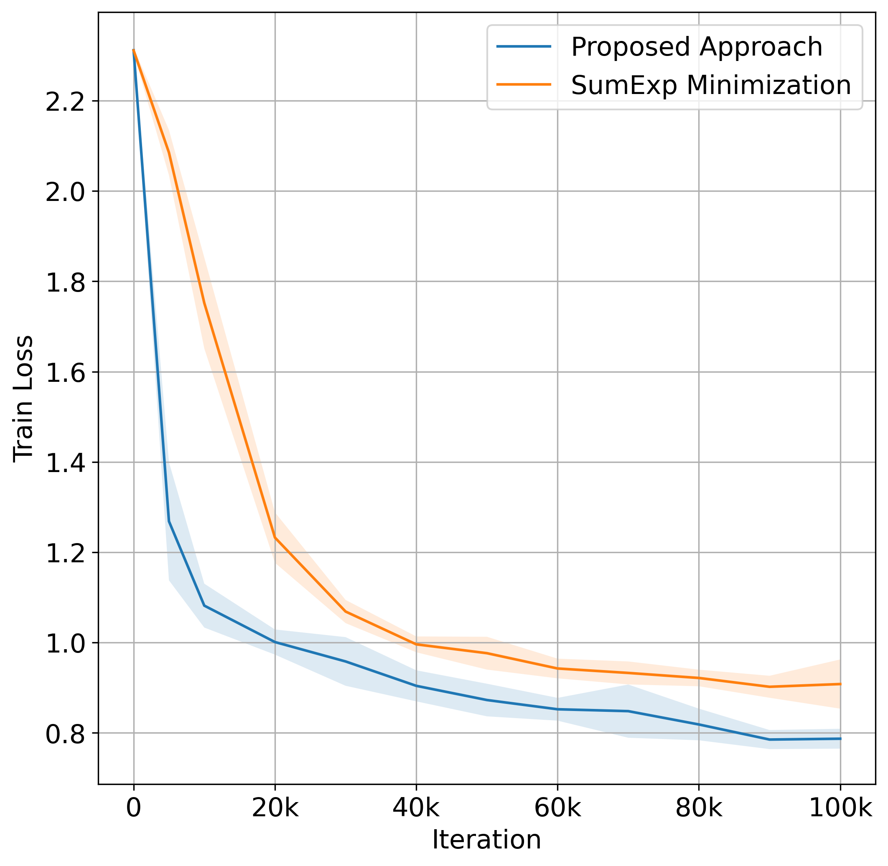

## About

The paper ***Improved Stochastic Optimization of LogSumExp*** ([arxiv preprint](https://arxiv.org/abs/2509.24894)) introduces a LogSumExp approximation with tunable accuracy that can be efficiently optimized with stochastic methods.
This repository contains the experiments described in the paper, covering distributionally robust optimization (DRO) and entropy-regularized continuous optimal transport problems.
The experiments highlight numerical issues in existing LogSumExp optimization approaches and demonstrate how the proposed approximation addresses them, leading to superior performance.

To cite the preprint, use the following BibTeX entry:
```
@misc{gladin2025logsumexp,
  title={Improved Stochastic Optimization of LogSumExp},
  author={Egor Gladin and Alexey Kroshnin and Jia-Jie Zhu and Pavel Dvurechensky},
  year={2025},
  eprint={2509.24894},
  archivePrefix={arXiv},
  url={https://arxiv.org/abs/2509.24894}
}
```

## Example Plots: Distributionally Robust Optimization (DRO) with Unbalanced OT

In one of the experiments, a small CNN is trained on MNIST dataset where 25% of train and validation labels are corrupted with feature-dependent noise (see [gorkemalgan/corrupting_labels_with_distillation](https://github.com/gorkemalgan/corrupting_labels_with_distillation/)). Test labels remain clean.

We consider three training strategies:

- **ERM (standard training on noisy data)**
- **Baseline DRO: sum of exponents minimization**, see [Outlier-Robust DRO via Unbalanced OT](https://proceedings.neurips.cc/paper_files/paper/2024/hash/5d68a3f05ee2aae6a0fb2d94959082a0-Abstract-Conference.html)
- **Proposed DRO approach with our LogSumExp approximation**

<div style="display: flex; gap: 8px;">

  

  

  

</div>

**Key observations:**

- **ERM overfits to noisy labels** — validation accuracy rises while test accuracy drops.
- **Both DRO approaches generalize better**, preserving alignment between validation and test accuracy.
- **The proposed approximation converges faster and more stably**, while the baseline is hindered by numerical issues unless a very small stepsize is used.

## System Information

The following system was used to run all experiments in the paper:

- **OS**: Windows 10 Home, version 10.0.19045
- **CPU**: Intel Core i7-8550U, 4 cores / 8 threads
- **RAM**: 16 GB
- **GPU**: NVIDIA GeForce GTX 1050 with Max-Q Design
- **CUDA**: 12.1
- **Python**: 3.12.7
- **PyTorch CUDA**: available (torch.version.cuda = 12.1)

## Environment Setup

Before running the experiments, do the following:

```
# Create a virtual environment
python -m venv venv

# Activate it (on Linux, use `source venv/bin/activate`)
venv\Scripts\activate

# Upgrade pip (optional)
python -m pip install --upgrade pip

# Install dependencies
pip install -r requirements.txt
```

## Structure

- Executing `python plot_f_rho.py` produces Figure 1 from the paper, i.e., plot of $f_{\rho}(t)$ for different values of $\rho$. 
- Folders `eot`, `kl-dro` and `uot-dro` correspond to experiments in continuous entropy-regularized optimal transport, distributionally
robust optimization (DRO) with KL divergence, and DRO with unbalanced optimal transport, respectively. To run each
experiment, navigate to the dedicated folder and execute `python main.py`.
- Depending on your setup, experiments may take from a few minutes
up to **a few hours** due to repeated runs with different seeds.
